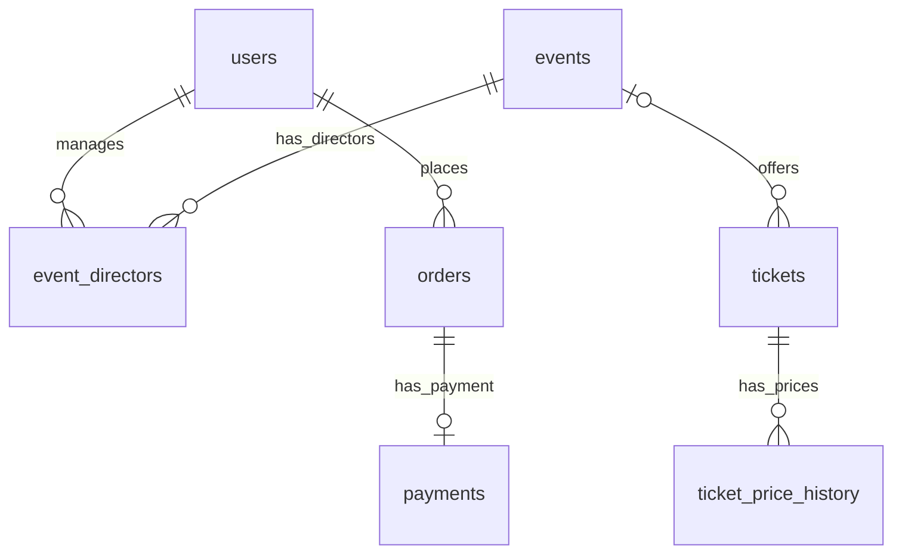

# DB 분석 보고서

작성일: 2026-09-22

## 1. 분석 범위와 핵심 요약

공연·전시 예매 서비스의 DB를 저장소에 있는 SQL, JPA 엔티티, Repository, 서비스 코드 기준으로 분석했다. **실행 중인 MySQL에 접속한 결과가 아니므로 실제 테이블 구조, 데이터 건수, 실행 계획은 확인하지 않았다.** 아래의 컬럼 타입·NULL·제약조건은 `backend/backup.sql` 기준이다.

- SQL에 정의된 테이블은 7개이고, JPA 엔티티는 6개다. `ticket_price_history`만 엔티티가 없다.
- 핵심 흐름은 회원 → 행사별 티켓 선택 → 주문 생성 → 결제 승인 → 판매 수량 증가다.
- 주문 시점의 단가와 총액을 주문에 보관하고, 주문·결제 키의 UNIQUE 제약으로 중복을 제한한다.
- 주문의 행사·티켓 ID는 논리적 참조이며 SQL 외래키는 없다.
- 결제 외부 승인과 DB 커밋 사이의 실패 복구, 상태 관리, 데이터 무결성 보강이 주요 검토 대상이다.

## 2. DB 구성

| 항목 | 저장소에서 확인한 설정 |
|---|---|
| DBMS | Docker Compose의 `mysql:8.0` |
| 초기 DB 이름 | `free_ticket` |
| 스토리지 엔진 | InnoDB |
| 문자 집합 / 정렬 규칙 | `utf8mb4` / `utf8mb4_0900_ai_ci` |
| 기본키 | 모든 테이블의 `id`: BIGINT, AUTO_INCREMENT |
| 접근 계층 | Spring Data JPA / Hibernate |
| 애플리케이션 접속 주소 | 환경변수 `DB_URL`; Compose DB와 동일한 접속 대상인지는 미확인 |
| 스키마 설정 | `spring.jpa.hibernate.ddl-auto=update` |
| 초기화 파일 | Compose가 `backup.sql`을 초기화 디렉터리에 마운트 |
| 테스트 DB | H2 메모리 DB, MySQL 모드, `create-drop` |
| 시간 관련 설정 | MySQL 컨테이너 `TZ=Asia/Seoul`; Java 코드는 `LocalDateTime.now()` 사용 |

애플리케이션 JVM 시간대와 DB 세션 시간대의 실제 일치 여부는 확인이 필요하다. `datetime(6)` 컬럼 자체에는 시간대가 포함되지 않는다.

## 3. 테이블 관계

아래 ERD는 **SQL에서 선언된 외래키만** 나타낸다.



| 관계 | 제약 및 의미 |
|---|---|
| users ↔ events | `event_directors`를 통한 다대다 관계. `(event_id, user_id)` 중복 금지 |
| events → tickets | 1:N. `tickets.event_id`가 NULL 가능하므로 행사 없는 티켓도 SQL상 허용 |
| tickets → ticket_price_history | 1:N. 가격 이력은 반드시 티켓 참조 |
| users → orders | 1:N. 주문은 반드시 회원 참조 |
| orders → payments | 1:0..1. 결제는 반드시 주문 참조, 주문당 결제 레코드는 최대 1개 |
| events → orders | `orders.event_id`를 통한 논리적 관계. FK 없음, NULL 허용 |
| tickets → orders | `orders.ticket_id`를 통한 논리적 관계. FK 없음, NULL 허용 |

**이름이 같은 두 `order_id`를 구분해야 한다.** `orders.order_id`는 외부 결제 연동용 VARCHAR(64) 주문번호이고, `payments.order_id`는 `orders.id`를 참조하는 BIGINT 내부 키다.

## 4. 테이블별 컬럼 정의

표의 NULL은 NULL 허용 여부다. PK는 기본키, FK는 외래키, UQ는 유일성 제약이다. 애플리케이션에서 설정하는 초깃값은 SQL DEFAULT와 구분했다.

### 4.1 users — 회원

| 컬럼 | SQL 타입 | NULL | 의미 / 제약 |
|---|---|---|---|
| id | BIGINT | 불가 | PK, 자동 증가 |
| customer_key | VARCHAR(255) | 허용 | 결제 고객 식별자, UQ 없음 |
| email | VARCHAR(255) | 불가 | 이메일, UQ |
| password | VARCHAR(255) | 불가 | PasswordEncoder로 인코딩한 비밀번호 |
| phonenumber | VARCHAR(255) | 허용 | 전화번호, DB UQ 없음 |
| username | VARCHAR(255) | 불가 | 회원 이름 |
| role | ENUM('ADMIN','DIRECTOR','USER') | 불가 | 회원 권한 |
| status | ENUM('ACTIVE','DELETED') | 불가 | 회원 상태 |

가입 로직은 전화번호 중복을 조회하지만 DB UNIQUE 제약은 없다. 동시 요청의 중복까지 DB가 보장하지는 않는다. `USER`, `ACTIVE` 기본 상태는 Java 코드에서 설정한다.

탈퇴 시 행을 삭제하지 않고 `DELETED`로 바꾸며 이메일·전화번호 앞에 삭제 표시와 시간을 붙인다. 주문 참조는 유지되지만 원래 개인정보가 제거되거나 익명화되는 방식은 아니다.

### 4.2 events — 행사

| 컬럼 | SQL 타입 | NULL | 의미 / 제약 |
|---|---|---|---|
| id | BIGINT | 불가 | PK, 자동 증가 |
| name | VARCHAR(255) | 불가 | 행사명 |
| start_date | DATE | 불가 | 행사 시작일 |
| end_date | DATE | 불가 | 행사 종료일 |
| location | VARCHAR(255) | 불가 | 장소 |
| banner_image_url | VARCHAR(255) | 불가 | 배너 이미지 URL |
| main_image_url | VARCHAR(255) | 불가 | 대표 이미지 URL |
| category | VARCHAR(255) | 허용 | 분류 문자열 |
| description | VARCHAR(255) | 허용 | 행사 설명 |
| description_image_url | VARCHAR(255) | 허용 | 상세 설명 이미지 URL |
| running_time | INT | 허용 | 진행 시간 값; DB에 단위 제약 없음 |

카테고리 참조 테이블이나 ENUM 제약은 없다. 설명·이미지 URL 모두 최대 255자이므로 긴 설명 또는 긴 URL을 저장해야 하는 요구가 생기면 길이 검토가 필요하다.

### 4.3 event_directors — 행사 담당자

| 컬럼 | SQL 타입 | NULL | 의미 / 제약 |
|---|---|---|---|
| id | BIGINT | 불가 | PK, 자동 증가 |
| event_id | BIGINT | 불가 | FK → events.id |
| user_id | BIGINT | 불가 | FK → users.id |

`UNIQUE(event_id, user_id)`로 동일 회원의 동일 행사 중복 배정을 방지한다. 이 테이블에 들어가는 회원이 반드시 `DIRECTOR` 권한을 갖는다는 DB 제약은 없다. 대응 엔티티는 있으나 전용 Repository·서비스는 현재 소스에서 확인되지 않았다.

### 4.4 tickets — 행사별 판매 티켓

| 컬럼 | SQL 타입 | NULL | 의미 / 제약 |
|---|---|---|---|
| id | BIGINT | 불가 | PK, 자동 증가 |
| event_id | BIGINT | 허용 | FK → events.id |
| type | VARCHAR(255) | 불가 | 티켓 종류 |
| price | INT | 허용 | 현재 판매 단가 |
| total_ticket | INT | 허용 | 전체 판매 가능 수량 |
| sold_ticket | INT | 허용 | 결제 완료 시 증가하는 판매 수량 |
| booking_endtime | DATETIME(6) | 허용 | 예매 마감 시각 |
| start_time | DATETIME(6) | 허용 | 회차 시작 시각 |
| description | VARCHAR(255) | 허용 | 티켓 설명 |

개별 구매자에게 발급한 티켓 한 장이 아니라, 행사·회차·종류별 판매 단위를 나타낸다. 좌석 배정, 발권 번호, 입장 처리용 테이블은 현재 스키마에 없다.

엔티티의 잔여 수량 계산은 `total_ticket - sold_ticket`이다. 주문 생성에서는 여기에 유효한 대기 주문 수량까지 차감하므로 두 계산의 의미가 다르다. 엔티티의 잔여 수량·예매 가능 여부 메서드는 일부 NULL 값에서 예외가 날 수 있지만, DB 컬럼은 NULL을 허용한다.

### 4.5 ticket_price_history — 티켓 가격 이력

| 컬럼 | SQL 타입 | NULL | 의미 / 제약 |
|---|---|---|---|
| id | BIGINT | 불가 | PK, 자동 증가 |
| ticket_id | BIGINT | 불가 | FK → tickets.id |
| price | INT | 불가 | 이력 단가 |
| changed_at | DATETIME(6) | 불가 | DEFAULT CURRENT_TIMESTAMP(6) |

`(ticket_id, changed_at)` 복합 인덱스가 있다. 테이블 DDL은 존재하지만 대응 엔티티·Repository·저장 로직 및 SQL 트리거는 확인되지 않았다. 따라서 가격 변경 시 자동으로 이력이 쌓인다고 볼 수 없다.

### 4.6 orders — 주문

| 컬럼 | SQL 타입 | NULL | 의미 / 제약 |
|---|---|---|---|
| id | BIGINT | 불가 | PK, 자동 증가 |
| order_id | VARCHAR(64) | 불가 | 외부 주문번호, UQ |
| user_id | BIGINT | 불가 | FK → users.id |
| event_id | BIGINT | 허용 | 행사 ID, FK 없음 |
| ticket_id | BIGINT | 허용 | 티켓 ID, FK 없음 |
| quantity | INT | 불가 | 주문 수량 |
| unit_price | INT | 불가 | 주문 생성 당시 단가 |
| total_amount | BIGINT | 불가 | 주문 생성 당시 총액 |
| status | ENUM | 허용 | 아래 상태 목록 참조 |
| order_date | DATETIME(6) | 허용 | 주문 생성 시각 |
| expires_at | DATETIME(6) | 허용 | 결제 가능 만료 시각 |
| paid_at | DATETIME(6) | 허용 | 결제 완료 처리 시각 |
| idempotency_key | VARCHAR(36) | 불가 | 결제 승인 요청 멱등키, UQ |

상태 값: `PENDING`, `CONFIRMING`, `PAID`, `PAYMENT_FAILED`, `CANCELED`, `EXPIRED`.

주문 생성 코드는 `total_amount = (long) unit_price * quantity`로 계산하고, 결제 기한을 10분으로 설정한다. 생성 요청 DTO는 수량 1~10을 검증한다. 이러한 값 범위와 금액 등식에 대한 SQL CHECK 제약은 없다.

가격 스냅샷은 보존되지만 행사명·장소·회차 등의 주문 시점 스냅샷은 없다. 예매 내역 조회는 현재 티켓·행사 데이터를 가져오므로 원본 변경이 과거 내역 표시에 영향을 줄 수 있다.

### 4.7 payments — 결제 승인 결과

| 컬럼 | SQL 타입 | NULL | 의미 / 제약 |
|---|---|---|---|
| id | BIGINT | 불가 | PK, 자동 증가 |
| order_id | BIGINT | 불가 | FK → orders.id, UQ |
| payment_key | VARCHAR(200) | 불가 | 결제 제공자 식별 키, UQ |
| amount | BIGINT | 불가 | 승인 금액 |
| method | VARCHAR(255) | 허용 | 결제 수단 |
| status | VARCHAR(30) | 불가 | 외부 결제 상태; 현재 승인 로직은 DONE만 저장 |
| approved_at | DATETIME(6) | 허용 | 현재 코드는 서버 처리 시각 저장 |
| receipt_url | VARCHAR(500) | 허용 | 영수증 URL |

현재 구조는 주문당 승인 결과 1개를 보관한다. 결제 시도별 이력이나 여러 건의 부분 취소 이력을 별도 행으로 저장하는 구조는 아니다.

## 5. 주문·결제 처리와 트랜잭션

### 주문 생성

1. 회원을 조회하고 티켓을 `PESSIMISTIC_WRITE` 잠금으로 조회한다.
2. 예매 마감, 가격, 재고 필드의 유효성을 검사한다.
3. 같은 티켓의 `PENDING`, `CONFIRMING` 주문 중 `expires_at > 현재 시각`인 수량을 합산한다.
4. `전체 수량 - 판매 완료 수량 - 유효 대기 주문 수량`으로 구매 가능 여부를 검사한다.
5. 주문번호, UUID 멱등키, 단가·총액, 10분 기한을 저장한다. 고객 키가 없으면 함께 생성한다.

이 단계에서는 `sold_ticket`을 늘리지 않는다. 주문 행이 일정 시간 재고를 점유하는 역할을 한다.

### 결제 승인

1. 주문을 회원 ID와 주문번호로 조회하면서 쓰기 잠금을 획득한다.
2. 이미 `PAID`이면 기존 결제 결과를 반환한다.
3. 주문 상태, 만료 시각, 요청 금액, 결제 키 중복을 검사한다.
4. `CONFIRMING`으로 변경하고 주문의 멱등키를 사용해 Toss 승인 API를 호출한다.
5. 외부 응답의 주문번호·금액·DONE 상태를 검사한다.
6. 티켓을 쓰기 잠금으로 읽고 수량을 확인한 뒤 `sold_ticket`을 증가시킨다.
7. 주문을 `PAID`로 바꾸고 결제 행을 저장한다.

전체가 하나의 `@Transactional` 메서드 안에 있다. `CONFIRMING`은 별도 트랜잭션으로 먼저 커밋되는 상태가 아니다. `ApiException`은 RuntimeException이며, 실패를 별도 상태로 저장하는 처리도 없어 예외 발생 시 DB 변경은 롤백 대상이다.

`PAYMENT_FAILED`, `CANCELED`, `EXPIRED`는 enum에 있지만 현재 서비스의 해당 상태 전환은 확인되지 않았다. 만료 주문은 승인 요청 시 거부되고 재고 점유 합산에서 제외되지만, 자동으로 `EXPIRED`가 저장되는 것은 아니다.

**코드에서 도출한 실패 가능성:** 외부 승인 성공 후 재고 검사 또는 DB 저장이 실패하면 DB 롤백만으로 외부 승인이 취소되지는 않는다. 승인 지연 중 주문 점유 시간이 지나 다른 주문에 재고가 배정되는 경우도 검토해야 한다. 실제 장애 발생을 확인한 것은 아니며, 승인 결과 재조회·대사·보상 취소와 동시성 검증이 필요한 지점이다.

## 6. 조회 패턴과 인덱스

| 조회 | 현재 구현 | 인덱스 검토 후보 |
|---|---|---|
| 회원 이메일 조회 | 이메일 조건 | 기존 email UQ 활용 가능 |
| 행사 카테고리 목록 | DISTINCT category | events(category) |
| 카테고리별 행사 조회 | 선택적 category 조건 | events(category); 전체 조회와 분리 여부 검토 |
| 행사별 티켓 조회 | event_id 조건, start_time ASC·price DESC | tickets(event_id, start_time, price DESC) |
| 대기 주문 재고 합산 | ticket_id, status, expires_at 조건 | orders(ticket_id, status, expires_at) |
| 주문번호별 조회 | order_id 및 user_id 조건 | 기존 order_id UQ 활용 가능 |
| 회원 결제 내역 | user_id·status 조건, paid_at DESC, payments 조인 | orders(user_id, status, paid_at) |
| 가격 이력 조회용 구조 | 티켓별 변경 시각 | 기존 (ticket_id, changed_at) |

후보 인덱스는 **실측 전 제안**이다. 데이터 규모와 분포, 실제 생성 SQL의 실행 계획을 확인한 뒤 결정해야 한다. 현재 `orders`의 명시적 보조 인덱스는 `user_id`이며 `ticket_id` 검색용 인덱스는 DDL에 없다.

`event_directors`에는 `(event_id, user_id)` UNIQUE와 별도 `event_id` 인덱스가 함께 있어 중복 가능성을 검토할 수 있다. FK 요구와 실행 계획 확인 없이 삭제해서는 안 된다.

인기 행사와 주간 랭킹은 모두 티켓의 `sold_ticket` 합계를 기준으로 `DENSE_RANK`를 계산한다. **주간 랭킹 쿼리에는 날짜 조건이 없으므로 현재 구현은 누적 판매량 순위다.** 실제 주간 순위가 필요하면 기간 내 결제 완료 주문의 `paid_at`과 `quantity`를 기준으로 집계하는 방안을 검토할 수 있다.

예매 내역은 결제·주문을 fetch join으로 조회한 뒤 티켓 ID를 모아 티켓·행사를 일괄 조회한다. 이 경로는 티켓을 주문마다 개별 조회하는 방식의 반복 쿼리를 피하도록 작성돼 있다.

## 7. 무결성과 운영 개선 항목

아래는 저장소 분석에 따른 검토 제안이며, 스키마나 코드는 변경하지 않았다.

| 우선순위 | 확인 내용 | 개선 방향 |
|---|---|---|
| 높음 | 외부 결제 승인 후 DB 실패에 대한 복구가 confirm 흐름에 없음 | 승인 재조회·대사·보상 취소, 장애 및 동시성 시나리오 검증 |
| 높음 | orders.ticket_id·event_id의 FK 없음 | 고아 데이터 검사 후 FK 도입 또는 의도적인 참조 정책 명문화 |
| 높음 | 티켓의 필수 재고·가격·마감 값이 NULL 가능 | 기존 데이터 정리 후 업무상 필수 컬럼 NOT NULL 검토 |
| 높음 | 음수 재고·가격, 수량 범위, 총액 등식의 DB 제약 없음 | 서비스 검증과 CHECK 제약 보강 검토 |
| 중간 | 주문 실패·만료·취소 상태 전환 미구현 | 상태별 전이 조건 및 만료 처리 정책 정의 |
| 중간 | 두 개의 주문 참조 ID가 서로 다른 행사를 가리킬 수 있음 | 주문 행사와 티켓 행사 일치 검증; FK 두 개만으로는 일치 보장 불가 |
| 중간 | 가격 이력 테이블에 연결된 기록 로직 없음 | 가격 변경과 이력 추가를 같은 트랜잭션으로 관리 |
| 중간 | 과거 주문의 행사·티켓 표시 정보가 현재 원본에 의존 | 보존할 항목의 주문 스냅샷 여부 결정 |
| 중간 | ddl-auto=update 사용, 버전형 마이그레이션 파일 미확인 | 스키마 변경 이력과 배포 절차 관리 |
| 중간 | SQL 바인딩 TRACE 설정 | 실행 환경별 로그 수준 분리 및 민감 값 노출 점검 |
| 중간 | 전화번호 중복 검사가 애플리케이션에만 존재 | 전화번호 유일성이 요구된다면 DB 제약과 정규화 정책 검토 |
| 중간 | 탈퇴 후 개인정보 원문이 삭제 표시 뒤에 유지됨 | 서비스의 개인정보 보존·익명화 정책에 맞게 처리 방식 결정 |
| 낮음 | 생성·수정 시각이 여러 테이블에 없음 | 필요한 테이블에 감사 필드 도입 |

DDL에는 명시적 `ON DELETE CASCADE`가 없고 JPA 연관관계에도 삭제 cascade 설정이 없다. 부모 행 삭제 시 종속 데이터 처리 정책을 별도로 결정해야 한다.

## 8. SQL 파일과 데이터 해석

| 파일 | 확인 결과 |
|---|---|
| backend/backup.sql | CREATE TABLE 7개. INSERT 데이터가 없는 스키마 파일 |
| backend/events-dummy.sql | events 삽입용 더미 데이터 96행 |

더미 행사 분포는 musical·play·exhibition·classic·concert·busking 각각 16행이다. 이는 **파일에 적힌 행 수**이며 실제 DB 적재 건수가 아니다. 더미 파일에는 기존 ID와 충돌하면 오류가 난다는 안내가 있고, Compose의 초기화 마운트에는 이 파일이 포함돼 있지 않다.

`AUTO_INCREMENT=617` 같은 선언은 실제 행 수를 뜻하지 않는다. SQL 파일만으로 회원 수, 주문 수, 매출, 판매율, 실제 고아 데이터 여부는 판단할 수 없다.

## 9. 실제 DB에서 추가 확인할 읽기 전용 SQL

다음 SQL은 문서에만 제시했으며 실행하지 않았다. 실제 서비스 접속 대상과 시간 기준을 확인한 후 사용한다.

```sql
-- 테이블별 실제 행 수
SELECT 'users' AS table_name, COUNT(*) AS row_count FROM users
UNION ALL SELECT 'events', COUNT(*) FROM events
UNION ALL SELECT 'event_directors', COUNT(*) FROM event_directors
UNION ALL SELECT 'tickets', COUNT(*) FROM tickets
UNION ALL SELECT 'ticket_price_history', COUNT(*) FROM ticket_price_history
UNION ALL SELECT 'orders', COUNT(*) FROM orders
UNION ALL SELECT 'payments', COUNT(*) FROM payments;

-- 주문의 고아 참조와 행사 불일치
SELECT o.id, o.ticket_id, o.event_id, t.event_id AS ticket_event_id
FROM orders o
LEFT JOIN tickets t ON t.id = o.ticket_id
LEFT JOIN events e ON e.id = o.event_id
WHERE t.id IS NULL OR e.id IS NULL
   OR NOT (o.event_id <=> t.event_id);

-- 재고·가격 이상
SELECT id, price, total_ticket, sold_ticket
FROM tickets
WHERE price IS NULL OR price < 0
   OR total_ticket IS NULL OR total_ticket < 0
   OR sold_ticket IS NULL OR sold_ticket < 0
   OR sold_ticket > total_ticket;

-- 주문 총액 불일치 및 잘못된 수량
SELECT id, quantity, unit_price, total_amount
FROM orders
WHERE quantity <= 0 OR unit_price < 0
   OR total_amount <> unit_price * quantity;

-- 결제 완료 주문과 결제 레코드 불일치
SELECT o.id, o.status, o.total_amount, p.amount, p.status AS payment_status
FROM orders o
LEFT JOIN payments p ON p.order_id = o.id
WHERE (o.status = 'PAID' AND p.id IS NULL)
   OR (p.id IS NOT NULL AND (
       o.status IS NULL OR o.status <> 'PAID'
       OR p.amount <> o.total_amount OR p.status <> 'DONE'));

-- 상태는 대기이지만 기한이 지난 주문 수
SELECT status, COUNT(*) AS expired_count
FROM orders
WHERE status IN ('PENDING', 'CONFIRMING') AND expires_at <= NOW(6)
GROUP BY status;
```

## 10. 분석 근거 파일

경로는 저장소 루트 기준이다.

- `backend/backup.sql`, `backend/events-dummy.sql`: 스키마와 더미 데이터.
- `backend/docker-compose.yml`, `backend/build.gradle`, `backend/src/main/resources/application.properties`: DB 및 ORM 설정.
- `backend/src/test/resources/application.properties`: 테스트 DB 설정.
- `backend/src/main/java/wamddu/backend/{user,event,eventDirector,ticket,order,payment}/domain/`: 엔티티와 상태 enum.
- `backend/src/main/java/wamddu/backend/{user,event,ticket,order,payment}/repository/`: 조회, 집계 및 잠금 정의.
- `backend/src/main/java/wamddu/backend/order/service/OrderService.java`: 주문·재고 점유·예매 내역.
- `backend/src/main/java/wamddu/backend/payment/service/PaymentService.java`: 승인·판매 수량 갱신·결제 저장.
- `backend/src/main/java/wamddu/backend/user/service/UserService.java`: 회원 생성·중복 검사·탈퇴.
- `backend/src/main/java/wamddu/backend/order/dto/request/CreateOrderRequest.java`: 요청 수량 검증.
- `backend/src/main/java/wamddu/backend/global/exception/ApiException.java`: 트랜잭션 예외 분석.
