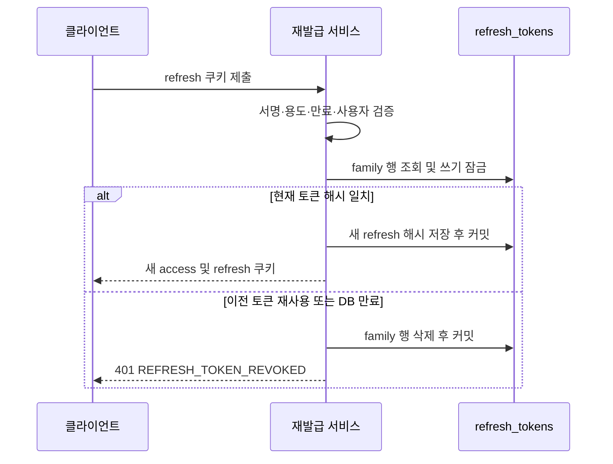

# 로그인 토큰 전략 변경 구현 보고서

작성일: 2026-10-01 · 브랜치: `codex/token-strategy-change` · 구현 기준 커밋: `0c48a1eec9e6a5dd0eef0f674e3520989033822f`

Access는 서버 저장소를 조회하지 않는 JWT로 유지하고, refresh는 로그인별 현재 토큰의 해시를 DB에 저장하여 회전과 폐기를 관리하도록 변경했다. 기본 access 수명은 10분, refresh의 최대 유지 기간은 최초 로그인부터 7일이다. 프런트는 재발급 요청을 공유하고 쿠키 변경을 직렬화하며, 이전 계정의 요청을 새 계정 토큰으로 재시도하지 않도록 처리한다.

HTTP 세션, access용 DB 상태 조회, Redis, 신규 라이브러리는 추가하지 않았다. 운영 DB 마이그레이션과 서비스 배포는 이번 작업에서 실행하지 않았다.

## 1. 기존 구현에서 확인한 문제

비교 기준은 구현 커밋의 부모인 `7457107`과 변경 후 `0c48a1e`다. 아래 내용은 코드 비교와 회귀 테스트로 확인한 동작이다.

### 백엔드

| 문제 | 기존 동작과 영향 | 변경 후 |
|---|---|---|
| Access와 refresh 용도 혼용 | 같은 서명 키와 공통 검증 함수만 사용하여 access를 refresh 쿠키로 제출해 재발급할 수 있었다. Refresh도 인증 객체를 만들 수 있었다. | `token_use`를 필수로 검증하고 두 용도의 상호 대체를 거부한다. |
| 사용한 refresh 구분 불가 | 서버에 토큰 상태가 없어 이전 토큰 재사용을 감지할 수 없었다. | 현재 해시만 저장하고, 이전 토큰 재사용 시 로그인 묶음을 폐기한다. |
| 로그아웃의 서버 폐기 부재 | 쿠키만 삭제하여 복사된 refresh는 원래 만료까지 사용할 수 있었다. | 현재 로그인 묶음의 DB 행을 삭제한다. |
| 비밀번호 변경 후 refresh 유지 | 기존 로그인에서 발급한 refresh를 계속 사용할 수 있었다. | 비밀번호 변경과 탈퇴 시 사용자의 모든 로그인 묶음을 폐기한다. |
| 유지 기간의 반복 연장 | 재발급마다 현재 시점 기준 7일을 다시 부여했다. | 최초 로그인 만료 시각을 유지한다. |
| 동일 토큰 생성 가능 | 무작위 식별자가 없어 같은 사용자에게 같은 초에 발급한 refresh가 동일 문자열이 될 수 있었다. | 로그인별 `family_id`와 회전별 `jti`를 무작위 UUID로 발급한다. |
| 실제 수명과 응답 불일치 | `expiresIn`은 1,800초로 고정되어 실제 설정과 어긋날 수 있었다. | JWT 수명과 응답을 같은 설정값에서 계산한다. |
| 쿠키 경로 문제 | `/api/auth/refresh` 쿠키는 `/api/auth/logout`에 전달되지 않았다. | 경로를 `/api/auth`로 넓히고 이전 경로 쿠키를 정리한다. |
| 인증 종료의 오류 분류 | 대상 사용자가 없거나 비활성 상태이면 404를 반환했다. | 명시적인 인증 종료 코드와 401을 반환한다. |

Refresh를 일반 API에 제출했을 때 기존 역할은 `ROLE_null`이었다. 이는 단순 인증만 요구하는 API에서 용도가 혼용되는 문제이며, refresh만으로 관리자 권한을 얻었다는 의미는 아니다.

### 프런트

| 문제 | 기존 동작과 영향 | 변경 후 |
|---|---|---|
| 재발급 경로 중복 | 초기 복원과 Axios가 따로 refresh를 실행하고 복수의 만료 요청도 각각 재발급했다. | 같은 인증 세대는 refresh Promise 하나를 공유한다. |
| 일시 장애를 로그아웃으로 처리 | 네트워크와 서버 오류까지 인증을 삭제했다. | 확인된 인증 종료만 상태를 지우고 일시 장애는 실패를 전달한다. |
| 늦은 응답의 상태 덮어쓰기 | 이전 refresh나 사용자 조회 응답이 새 로그인 상태를 덮어쓸 수 있었다. | 인증 세대가 바뀐 응답은 적용하지 않는다. |
| 토큰 중복 저장 | Context와 Axios에 따로 저장하고 자동 refresh는 모듈 값만 바꿨다. | 토큰 모듈 하나를 기준으로 사용한다. |
| 로그아웃 실패 은폐 | 서버 실패를 삼킨 뒤 완료를 알리고 페이지를 새로고침했다. | 실패를 전달하고 화면에 오류를 표시한다. |
| 복원 실패와 비로그인 혼동 | 초기 복원의 일시 장애도 비로그인으로 확정했다. | 복원 오류를 별도 상태로 두고 재시도를 제공한다. |
| 계정 전환 중 요청 재시도 | 공유 쿠키가 바뀌면 이전 계정 요청에 새 계정 access가 붙을 수 있었다. | 인증 세대와 refresh 전후 사용자 ID를 확인해 재시도를 차단한다. |

## 2. 토큰 구조와 서버 상태

| 구분 | Access | Refresh |
|---|---|---|
| 용도 | 일반 API 인증 | 새 access와 refresh 발급 |
| 형식 | 서명된 JWT | 서명된 JWT |
| 필수 용도 claim | `token_use=access` | `token_use=refresh` |
| 사용자 | 양의 사용자 ID인 `sub` | 양의 사용자 ID인 `sub` |
| 추가 검증 | 유효한 `Role`, 만료 시각 | UUID 형식의 `family_id`, `jti`, 만료 시각 |
| 기본 수명 | 600초 | 최초 로그인부터 최대 7일 |
| 저장 | 프런트 메모리 | 브라우저 HttpOnly 쿠키, 서버에는 현재 해시 |
| 서버 상태 조회 | JWT 검증 자체에는 DB 조회 없음 | 현재 로그인 묶음 조회·잠금 |
| 재발급 시 변경 | 새 access 발급 | `jti` 변경, `family_id`와 만료 시각 유지 |

서명 키는 기존 `JWT_SECRET`을 계속 사용한다. 서로 다른 키를 추가하는 대신 서명된 `token_use` claim을 필수로 검증한다. 프런트 JavaScript는 HttpOnly 쿠키의 refresh 원문을 읽지 않는다.

### 왜 로그인별 DB 행이 필요한가

서명과 만료 시각만 확인하는 refresh에는 이미 사용했거나 로그아웃으로 폐기됐다는 정보가 없다. 현재 해시를 저장해야 이전 토큰과 최신 토큰을 구분하고 특정 로그인 또는 사용자의 전체 로그인 유지 권한을 폐기할 수 있다.

이 행은 refresh 수명주기를 관리하는 상태다. 넓은 의미에서는 로그인 세션 기록이라고 부를 수 있지만, `HttpSession`을 만들거나 일반 API마다 세션 저장소를 확인하는 구조는 아니다. Access 인증은 계속 stateless이고 refresh 재발급은 서버 상태를 확인한다.

### 저장 스키마

```sql
CREATE TABLE refresh_tokens (
    id VARCHAR(36) NOT NULL,
    user_id BIGINT NOT NULL,
    token_hash VARCHAR(64) NOT NULL,
    expires_at DATETIME(6) NOT NULL,
    PRIMARY KEY (id),
    KEY idx_refresh_token_user (user_id),
    KEY idx_refresh_token_expiry (expires_at)
);
```

- `id`는 로그인별 `family_id`다. 로그인 한 번에 행 하나를 저장한다.
- `token_hash`는 현재 refresh 전체 문자열의 SHA-256 해시이며 회전할 때 같은 행을 갱신한다.
- `expires_at`은 최초 로그인에서 정한 만료 시각이다.
- 사용자 인덱스는 전체 로그인 폐기에, 만료 인덱스는 오래된 행 정리에 사용한다.
- Refresh 원문, 이전 토큰 목록, 별도의 폐기 이력은 저장하지 않는다. 행 삭제가 폐기를 나타낸다.

만료 행은 로그인 시 정리한다. 정리 비용이 커지면 배치로 옮길 수 있도록 코드에 한계를 기록했다. 현재 배치나 별도 스케줄러는 추가하지 않았다.

## 3. 발급·회전·폐기 흐름

### 로그인

1. 이메일로 사용자 행을 잠그고 계정 상태와 비밀번호를 확인한다.
2. Access JWT와 새 refresh를 만든다.
3. Refresh의 `family_id`, 사용자 ID, 현재 해시, 최초 만료 시각을 저장한다.
4. Access와 사용자 정보는 기존 성공 JSON 구조로 반환하고 refresh는 HttpOnly 쿠키로 설정한다.

`expiresIn`은 JWT 설정에서 계산하며 기본값은 600초다. 설정값은 양의 정수 초 범위로 검증하고 밀리초의 소수 초 부분은 절삭한다.

### 재발급



새 refresh는 무작위 `jti`를 갖지만 로그인 묶음과 만료 시각은 유지한다. 쿠키 `Max-Age`도 최초 만료 시각까지 남은 시간으로 계산한다.

서명이 유효한 이전 refresh가 다시 제출되어 저장 해시와 다르면 해당 로그인 묶음을 삭제한다. 이전 토큰뿐 아니라 직전에 발급한 최신 refresh도 무효화된다. 동일 토큰이 동시에 두 번 제출되면 한 요청은 회전에 성공하고 다른 요청의 재사용 감지가 그 묶음을 폐기한다.

### 폐기 범위

| 사건 | 폐기 대상 | 다른 로그인 |
|---|---|---|
| 일반 로그아웃 | 현재 refresh의 `family_id` | 유지 |
| 비밀번호 변경 | 해당 사용자의 모든 refresh 행 | 모두 폐기 |
| 회원 탈퇴 | 해당 사용자의 모든 refresh 행 | 모두 폐기 |
| 이전 refresh 재사용 | 해당 `family_id` | 별도 묶음은 유지 |

로그아웃은 쿠키가 없거나 만료·손상된 경우에도 성공하도록 처리한다. 이미 발급된 access는 위 사건 이후에도 만료 전까지 JWT 검증상 유효하다. 기본 최대 약 10분이며, 실제 API에서 탈퇴 사용자 등의 상태를 조회하면 그 API의 추가 검증이 적용된다.

## 4. 트랜잭션과 경쟁 조건 처리

### 재사용 감지 후 폐기 커밋

폐기와 401 예외를 같은 트랜잭션에서 처리하면 예외 때문에 삭제가 롤백될 수 있다. `RefreshTokenStore.rotate()`는 `REQUIRES_NEW`에서 해시 교체 또는 삭제를 수행하고 정상 반환하여 먼저 커밋한다. 호출자는 실패 결과를 받은 뒤 401 예외를 던진다.

외부 `UserService.reissueToken()`에는 `NOT_SUPPORTED`를 적용했다. 외부 트랜잭션이 DB 연결을 보유한 채 내부 회전용 연결을 추가로 기다리는 구조를 없애 연결 풀 크기가 1인 환경에서도 처리하도록 했다.

### 이전 비밀번호 로그인과 비밀번호 변경

이전 비밀번호 검사를 통과한 로그인이 잠시 멈춘 사이 비밀번호 변경이 모든 refresh를 폐기하고, 그 뒤 로그인이 새 refresh를 저장하면 이전 자격 증명으로 얻은 refresh가 남을 수 있다.

로그인에서 사용하는 `findByEmail()`에 `PESSIMISTIC_WRITE`를 적용해 비밀번호 검사부터 refresh 저장까지 사용자 행을 잠근다. 비밀번호 변경의 사용자 행 UPDATE는 이 잠금과 직렬화된다. 명시적 조회 잠금은 로그인 조회에 있으며 비밀번호 변경의 `findById()`에 같은 잠금을 추가한 것은 아니다.

### Refresh 행의 원자적 처리

Refresh 조회도 `PESSIMISTIC_WRITE`를 사용한다. 사용자 ID와 DB 만료 시각을 확인하고 현재 해시를 비교한 다음 같은 잠금 아래에서 교체 또는 삭제한다. 해시 비교에는 `MessageDigest.isEqual()`을 사용한다.

## 5. 프런트 인증 흐름

### 재발급 공유와 재시도 제한

초기 복원과 Axios는 `refreshAccessToken()`을 함께 사용한다. 같은 인증 세대의 동시 호출은 하나의 Promise를 기다린다. 이미 다른 요청이 access를 갱신한 뒤 늦은 이전 토큰의 401이 도착하면 추가 refresh 없이 최신 토큰으로 재시도한다.

재시도는 `_retry`로 한 번만 허용한다. 재시도까지 다시 만료되면 반복 재발급하지 않는다. React Context의 사용되지 않는 access 복사본은 제거했다.

### 쿠키 변경 직렬화와 다른 탭

로그인·refresh·로그아웃·탈퇴는 같은 `free-ticket-auth` Web Lock을 사용한다. 진행 중 회전과 로그인·로그아웃의 쿠키 변경 순서를 통제한다. 성공한 로그인·로그아웃·탈퇴는 BroadcastChannel로 같은 origin의 다른 탭에 인증 변경을 알린다.

Web Locks가 없으면 쿠키 변경 요청을 보내지 않고 오류를 반환한다. 로그인 화면과 복원 화면에 HTTPS 또는 localhost와 지원 브라우저 사용 안내를 표시한다. BroadcastChannel은 브라우저가 제공하는 경우 사용한다.

### 이전 계정 요청의 재실행 차단

로그인·로그아웃 시작과 성공 시 인증 세대를 변경한다. 응답 처리뿐 아니라 Axios 요청을 실제 전송하기 직전에도 세대를 확인하므로 재시도 예약 이후 계정이 바뀌어도 새 계정 토큰을 붙이지 않는다.

다른 탭의 알림이 늦게 도착하는 경우도 처리한다. 현재 access가 있으면 refresh 결과의 사용자 `sub`와 비교하고 다르거나 payload가 잘못되면 인증을 초기화하고 원래 요청을 재실행하지 않는다. 네이티브 `atob`와 `JSON.parse`는 사용자 일치 확인에만 쓰며 JWT 서명 검증과 인가는 서버에서 수행한다.

이전 로그인 B의 응답을 상태에 적용하지 않더라도 서버 성공 응답은 공유 쿠키를 바꿀 수 있다. 따라서 폐기된 성공 응답도 이전 로컬 인증을 초기화하고 다른 탭에 알린다. 더 최신의 대기 중인 로그인 세대는 취소하지 않고 이미 완료된 더 최신의 로그인도 보존한다.

### 장애와 화면 처리

| 결과 | 처리 |
|---|---|
| 명시적 refresh 종료 코드의 401 | 토큰·사용자 상태 초기화 |
| 네트워크 오류, 5xx, 관련 없는 401 | 인증 유지, 실패 전달 |
| 초기 복원의 일시 장애 | 복원 오류 및 ‘다시 시도’ 표시 |
| 서버 로그아웃 실패 | 사용자·토큰 유지, 오류 표시, 성공 안내·강제 새로고침 없음 |
| Web Locks 미지원 | 쿠키 변경 거부 및 해결 안내 표시 |

로그인·refresh·로그아웃·사용자 조회·탈퇴의 각 HTTP 요청에는 10초 제한 시간을 적용한다. 잠금 대기와 여러 요청을 포함한 전체 흐름의 총 시간을 10초로 제한하는 것은 아니다.

탈퇴는 쿠키 잠금 안에서 자동 refresh를 실행하지 않는다. Access 만료가 확인되면 잠금을 해제한 뒤 refresh하고 탈퇴를 한 번 재시도하여 같은 잠금을 중첩 대기하는 교착을 방지한다. 유효한 access로 탈퇴할 때는 refresh 쿠키를 요구하지 않는다.

## 6. API와 쿠키 변경

로그인·재발급 성공 JSON의 필드 구조는 유지했다. 기본 `expiresIn`은 1,800에서 600초로 변경하고 설정과 일치시켰다. Refresh 만료 시각은 내부 결과 record에서 컨트롤러로 전달한다.

| 오류 코드 | HTTP | 의미 |
|---|---|---|
| `ACCESS_TOKEN_NOT_FOUND` | 401 | Access 없음 |
| `ACCESS_TOKEN_EXPIRED` | 401 | Access 만료, 클라이언트 재발급 대상 |
| `INVALID_ACCESS_TOKEN` | 401 | 용도·서명·필수 claim 등 부적합 |
| `REFRESH_TOKEN_NOT_FOUND` | 401 | Refresh 쿠키 없음 |
| `REFRESH_TOKEN_EXPIRED` | 401 | JWT 만료 |
| `INVALID_REFRESH_TOKEN` | 401 | 서명·용도·식별자 등 부적합 |
| `REFRESH_TOKEN_REVOKED` | 401 | 묶음 없음·재사용·DB 만료·사용자 비활성 등 |

쿠키는 `HttpOnly; Secure; SameSite=Lax; Path=/api/auth`다. 로그인·refresh 성공 응답과 로그아웃·탈퇴 응답은 기존 `/api/auth/refresh` 경로의 같은 이름 쿠키도 삭제한다. 모든 실패 응답에서 쿠키를 삭제하도록 변경한 것은 아니다.

## 7. 회귀 테스트와 확인 결과

아래 결과는 구현 과정의 최종 검증에서 얻었다. 보고서 작성 단계에서는 소스와 저장된 결과를 다시 대조했으며 코드 변경이나 전체 테스트 재실행은 하지 않았다.

| 검증 | 결과 | 비고 |
|---|---|---|
| 백엔드 전체 JUnit | 총 177개, 176개 통과, 1개 건너뜀, 실패·오류 0 | Gradle 성공, 약 1분 5초 |
| 새 백엔드 인증 회귀 | `TokenStrategyTest` 9개, `TokenLoginRaceTest` 1개 | 실제 서명 JWT, MockMvc, H2 |
| 프런트 전체 Vitest | 9개 파일, 75개 통과 | 변경 전 39개에서 인증 회귀 36개 추가 |
| 프런트 TypeScript·Vite | 통과 | 프로덕션 빌드 생성 |
| 프런트 lint | 기존 오류 8개 | 변경 전과 같고 새 오류 없음 |
| `git diff --check` | 통과 | 공백 오류 없음 |

최종 프런트 전체 검사와 빌드는 주 작업자도 별도로 확인했다. 백엔드 저장 결과와 로그의 최종 성공도 보고서 작성 시 재확인했다.

### 백엔드 회귀 시나리오

1. 실제 서명 토큰으로 access와 refresh의 상호 대체를 거부한다.
2. 실제 access 수명 600초와 응답 `expiresIn`이 일치한다.
3. 이전 refresh 재사용 후 401이 발생해도 최신 refresh의 폐기가 커밋되어 있다.
4. 최초 만료를 유지하고 `jti`를 변경하며 원문 대신 64자리 해시를 저장한다.
5. 특정 로그인만 로그아웃되고 다른 로그인은 유지된다. 두 경로 쿠키를 삭제하고 기존 access는 만료 전까지 유효하다.
6. 비밀번호 변경 시 복수 로그인 묶음을 폐기하고 탈퇴 시 refresh를 거부한다.
7. 같은 refresh 동시 제출에서 성공 한 건·실패 한 건이며 이후 성공 토큰도 폐기된다.
8. `TokenStrategyTest`를 연결 풀 크기 1에서 실행해 중첩 연결 요구 재발을 막는다.
9. 로그인 저장 직전에 멈추면 비밀번호 변경 UPDATE가 잠금으로 차단된다. 로그인 완료 후 비밀번호 변경은 해당 refresh를 폐기한다.

마지막 경쟁 검사는 H2의 제한된 잠금 대기 시간으로 실패를 결정적으로 관찰한다. 동시 refresh 검사는 풀 크기 1이므로 결과의 직렬화와 폐기는 확인하지만 여러 MySQL 연결 사이의 잠금 경쟁을 직접 검증한 것은 아니다.

### 프런트 회귀 시나리오

추가된 36개 검사는 인증 API 29개, Context 6개, 로그인 화면 1개다. 실제 Axios와 AuthProvider를 실행하고 외부 HTTP·Web Locks·BroadcastChannel은 제어 가능한 대역으로 처리한다.

- 초기 복원과 복수 만료 요청이 refresh 한 번을 공유한다.
- 늦은 이전 토큰의 401과 재시도 반복을 올바르게 처리한다.
- 일시 장애에서는 인증을 유지하고 확정된 종료에서는 초기화 이벤트가 한 번 발생한다.
- 늦은 refresh·사용자 조회·로그인 결과가 새 인증 상태를 덮어쓰지 않는다.
- 로그인 중 요청, 전송 직전 계정 변경, 지연된 탭 알림에도 이전 주문을 다른 계정으로 재실행하지 않는다.
- 폐기된 로그인 B의 서버 성공 이후 로그인 C가 실패해도 이전 A의 인증을 남기지 않는다.
- 잘못된 JWT payload를 적용하지 않는다.
- 복원 재시도, 로그아웃 실패 표시, 실제 로그인 화면의 브라우저 안내를 검증한다.
- 정체된 HTTP 요청과 탈퇴의 만료 재시도에서 쿠키 잠금이 영구 대기하지 않는다.

주요 회귀는 수정 전 실패를 확인하고 수정 후 통과를 확인했다. 최종 리뷰의 계정 전환과 안내 메시지 문제는 별도 회귀 5개로 검증했다.

### 재현 명령

백엔드 디렉터리에서 사용한 PowerShell 명령:

```powershell
$env:GRADLE_USER_HOME = 'C:/Users/c/.gradle'
.\gradlew.bat test --offline --no-daemon --rerun-tasks
```

캐시 경로와 `--offline`은 이번 로컬 환경 설정이다. 다른 환경에서는 해당 캐시에 의존성이 준비되어 있어야 한다.

프런트 디렉터리에서 실행:

```powershell
npm.cmd test
npm.cmd run build
npm.cmd run lint
```

건너뛴 테스트는 `LastTicketConcurrencyTest.oneRemainingTicketVsOneHundredBuyers()`다. 기존 `RUN_MYSQL_CONCURRENCY=true` 조건과 별도 MySQL 환경을 요구하며 이번 변경으로 새로 제외한 테스트가 아니다.

남아 있는 lint 오류는 NaverMap의 `any` 2개, AuthContext의 Fast Refresh export 규칙 1개, PasswordReset·ProfileModify의 `prefer-const` 4개, 지도 타입 선언의 `any` 1개다.

## 8. 배포 절차

다음 절차는 운영자가 실행할 항목이다. 배포 Compose는 Hibernate `ddl-auto=validate`를 사용하므로 기존 DB에 새 테이블이 없으면 애플리케이션 기동이 실패할 수 있다.

1. 기존 DB를 백업하고 `refresh_tokens`의 존재 여부를 확인한다.
2. 기존 DB에는 [마이그레이션 SQL](/C:/Study/Java/free_ticket/Free_Ticket/code/backend/db/2026-10-01-refresh-tokens.sql)을 한 번 적용한다. 일반 `CREATE TABLE`이므로 이미 적용한 DB에 그대로 다시 실행하지 않는다.
3. 신규 DB는 [backup.sql](/C:/Study/Java/free_ticket/Free_Ticket/code/backend/backup.sql)의 같은 테이블을 사용한다. 기존 볼륨에서는 초기화 SQL이 다시 실행되지 않는다. 마이그레이션을 위해 기존 볼륨을 삭제하지 않는다.
4. 환경변수를 `JWT_ACCESS_EXPIRATION_MS=600000`으로 설정한다. 이전 `JWT_EXPIRATION`은 새 서버에서 사용하지 않는다. 실제 비밀값을 담은 `.env`는 수정하지 않았다.
5. 서버와 프런트를 함께 배포한다. 한쪽만 변경한 상태를 완료된 배포로 취급하지 않는다.
6. HTTPS와 지원 브라우저, 단일 프런트 origin을 확인한다. 다른 origin은 Web Lock을 공유하지 않는다.
7. 기존 사용자는 재로그인하도록 안내한다. 이전 JWT에는 필수 용도와 refresh 식별자가 없다.
8. 로그인의 두 `Set-Cookie` 헤더, 새 쿠키 속성, 600초 응답, 테이블 행과 해시를 확인한다.
9. 재발급의 고정 만료, 로그아웃 후 재발급 거부, 비밀번호 변경 후 다른 로그인 폐기를 확인한다.
10. 실제 두 탭에서 만료 요청·로그아웃·다른 계정 로그인을 실행해 잠금과 화면 동기화를 추가 확인한다.

점검에 토큰 원문을 로그로 남기지 않는다. 행 존재 여부, 만료 시각, 응답 코드, 쿠키 속성을 확인한다.

### 롤백 시 유의점

이전 서버와 프런트로 함께 되돌릴 경우 이전 서버가 사용하는 `JWT_EXPIRATION` 설정도 복구해야 한다. 새 테이블은 기존 서버가 사용하지 않으므로 롤백을 위해 즉시 삭제할 필요가 없다.

두 경로가 남으면 같은 이름 쿠키가 중복될 수 있다. 브라우저 저장소 정리 또는 서버 만료 쿠키 응답으로 `/api/auth`와 `/api/auth/refresh`를 모두 정리하고 재로그인한다. HttpOnly 쿠키를 프런트 JavaScript에서 삭제하는 방법에 의존하지 않는다.

이전 구현으로 롤백하면 용도 혼용·재사용·폐기 문제가 다시 생긴다. 장애 대응 시 보안 영향도 판단해야 한다.

## 9. 남은 제약과 검증하지 않은 범위

| 항목 | 현재 상태와 영향 |
|---|---|
| Access 즉시 폐기 | 구현하지 않았다. 로그아웃·비밀번호 변경 후에도 기본 최대 약 10분간 기존 access가 유효하다. |
| 회전 응답 유실 | 새 쿠키를 못 받으면 이전 refresh의 다음 사용은 재사용으로 차단된다. 재로그인이 필요하며 이전 토큰 허용 유예는 없다. |
| 동일 refresh 직접 동시 제출 | 두 번째 제출이 묶음을 폐기한다. 프런트는 같은 origin의 쿠키 변경을 직렬화하지만 다른 클라이언트까지 통제하지 않는다. |
| 다른 프런트 origin | 잠금을 공유하지 않으므로 같은 API 쿠키를 사용하면 동시 회전 차단이 발생할 수 있다. |
| 이미 전송된 요청 | 인증 세대는 늦은 결과와 재시도를 막는다. 서버에 도착한 작업을 철회하거나 되돌리지는 않는다. |
| 만료 행 정리 | 로그인 시 수행하며 삭제량이 커지면 배치 전환을 검토한다. |
| 운영 MySQL | 마이그레이션 적용, 실제 스키마 검증, 복수 연결 잠금 경쟁·부하 측정을 수행하지 않았다. |
| 실제 다중 탭 | 자동 검사는 플랫폼 대역을 사용했다. 실제 두 탭 수동 검사는 수행하지 않았다. |
| 기존 lint | 오류 8개가 남아 있다. 전체 lint가 통과했다고 보고하지 않는다. |

서버 인스턴스 간 회전 상태는 DB 행 잠금으로 관리하여 별도 Redis 잠금은 추가하지 않았다. 운영 MySQL과 다중 인스턴스의 실제 부하·장애 검증을 이번 결과가 대신하는 것은 아니다.

## 10. 주요 변경 파일

구현 커밋은 설정·SQL·문서를 포함해 34개 파일을 변경했다. 핵심 동작은 다음 파일에 있다.

| 파일 | 역할 |
|---|---|
| [JwtProvider.java](/C:/Study/Java/free_ticket/Free_Ticket/code/backend/src/main/java/wamddu/backend/global/security/JwtProvider.java) | 용도 검증, 고정 만료, UUID 발급, 수명 계산 |
| [JwtAuthenticationFilter.java](/C:/Study/Java/free_ticket/Free_Ticket/code/backend/src/main/java/wamddu/backend/global/security/JwtAuthenticationFilter.java) | 잘못된 access claim을 401로 처리 |
| [RefreshToken.java](/C:/Study/Java/free_ticket/Free_Ticket/code/backend/src/main/java/wamddu/backend/user/domain/RefreshToken.java) | 로그인별 해시·만료 엔티티 |
| [RefreshTokenRepository.java](/C:/Study/Java/free_ticket/Free_Ticket/code/backend/src/main/java/wamddu/backend/user/repository/RefreshTokenRepository.java) | 행 잠금, 사용자 전체 폐기, 만료 정리 |
| [RefreshTokenStore.java](/C:/Study/Java/free_ticket/Free_Ticket/code/backend/src/main/java/wamddu/backend/user/service/RefreshTokenStore.java) | 해시 저장, 원자적 회전, 폐기 커밋 |
| [UserService.java](/C:/Study/Java/free_ticket/Free_Ticket/code/backend/src/main/java/wamddu/backend/user/service/UserService.java) | 로그인·재발급·폐기 처리 연결 |
| [UserRepository.java](/C:/Study/Java/free_ticket/Free_Ticket/code/backend/src/main/java/wamddu/backend/user/repository/UserRepository.java) | 로그인 자격 증명 행 잠금 |
| [UserController.java](/C:/Study/Java/free_ticket/Free_Ticket/code/backend/src/main/java/wamddu/backend/user/controller/UserController.java) | 남은 수명 기준 쿠키와 경로 정리 |
| [TokenStrategyTest.java](/C:/Study/Java/free_ticket/Free_Ticket/code/backend/src/test/java/wamddu/backend/user/service/TokenStrategyTest.java) | 실제 JWT·API·DB 인증 회귀 |
| [TokenLoginRaceTest.java](/C:/Study/Java/free_ticket/Free_Ticket/code/backend/src/test/java/wamddu/backend/user/service/TokenLoginRaceTest.java) | 로그인·비밀번호 변경 경쟁 |
| [token.ts](/C:/Study/Java/free_ticket/Free_Ticket/code/frontend/src/api/token.ts) | 단일 토큰 상태, 인증 세대, 잠금, 탭 알림, 사용자 ID 해석 |
| [axios.ts](/C:/Study/Java/free_ticket/Free_Ticket/code/frontend/src/api/axios.ts) | 공유 재발급, 오류 분류, 계정 확인, 1회 재시도 |
| [auth.ts](/C:/Study/Java/free_ticket/Free_Ticket/code/frontend/src/api/auth.ts) | 쿠키 변경 API 순서, 폐기된 성공 응답 처리 |
| [AuthContext.tsx](/C:/Study/Java/free_ticket/Free_Ticket/code/frontend/src/context/AuthContext.tsx) | 복원·재시도 및 늦은 상태 변경 방지 |
| [ProtectedRoute.tsx](/C:/Study/Java/free_ticket/Free_Ticket/code/frontend/src/components/ProtectedRoute.tsx) | 복원 장애 안내와 재시도 |
| [Mypage.tsx](/C:/Study/Java/free_ticket/Free_Ticket/code/frontend/src/pages/mypage/Mypage.tsx) | 로그아웃 실패와 중복 클릭 제어 |
| [Loginpage.tsx](/C:/Study/Java/free_ticket/Free_Ticket/code/frontend/src/pages/Loginpage.tsx) | 브라우저 지원 안내 |
| [auth.test.ts](/C:/Study/Java/free_ticket/Free_Ticket/code/frontend/src/api/auth.test.ts) | 인터셉터·회전·계정 전환·잠금 회귀 |
| [AuthContext.test.tsx](/C:/Study/Java/free_ticket/Free_Ticket/code/frontend/src/context/AuthContext.test.tsx) | 복원·로그아웃 오류와 화면 상태 회귀 |

기존 사용자 문서와 untracked README는 이 변경에 포함하지 않았다. 보고서 보강 커밋은 문서만 변경하며 구현 기준 커밋의 코드와 검증 결과를 설명한다.
